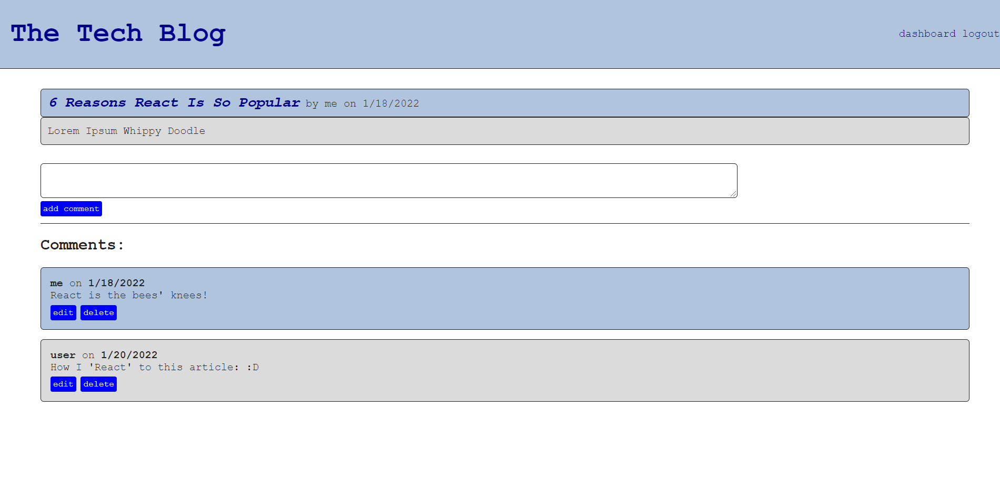

# The Tech Blog

## Purpose
A blog app demonstrating RESTful CRUD operations where a user can:
* signup to create an account
* create, update, and delete blog posts
* comment on other users' posts as well as their own posts. 

(As of now, the abilities to edit and delete comments are not functioning.)

## Built With
* JavaScript
* Handlebars
* CSS
* bcrypt
* connect-session-sequelize
* dotenv
* express
* express-session
* mysql2
* sequelize

## Screenshot Preview
